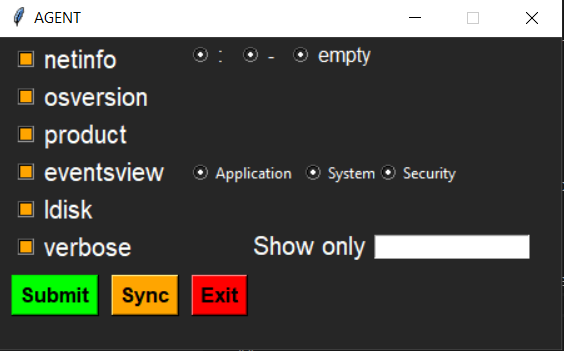
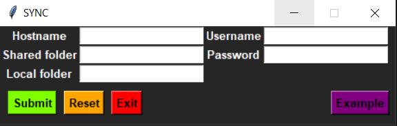

# agent
  

## description
> This project gets informations stored in the cim/wmi classes using some python scripts 

## directory
* bin
     * agent_gui.py
     * agent.bat
     * eventsview.py
     * ldisk.py
     * netinfo.py
     * osversion.py
     * product.py
     * sync_gui.py
     * sync.py
* doc
     * README.md
* img
     * 1.png
     * 2.png
* log
     * *.log
* flussi
    * *.csv
* requirements
    * requirements.txt

## requirements
* python3
* Windows 7/8/10
* pip3 libraries
     * pip3 install -r requirements\requirements.txt
* having python3 on path
     * see [this guide](https://geek-university.com/python/add-python-to-the-windows-path/) for more info

## execution
* to show all flags
     * agent.bat --help
* example
     * agent.bat -net -v --format=":"

## GUI execution
### 1) double click on the file agent.bat, located in the bin folder, a window like this should appear; there you must insert a set of options that the main program will use

### 2) if you click the sync button, another window will appear. Type 'py sync.py --help' for more info.

# changelog
### agent_02_01
* implemented code with some standards
* added sync program and GUI

### agent_01_01
* first version

# contacts
* 18605@studenti.marconiverona.edu.it - De Battisti Tommaso
* 18617@studenti.marconiverona.edu.it - Falsarolo Leonardo
* 18774@studenti.marconiverona.edu.it - Scamperle Mattia

