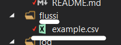
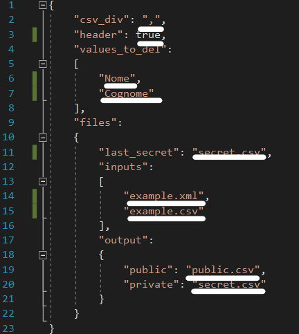
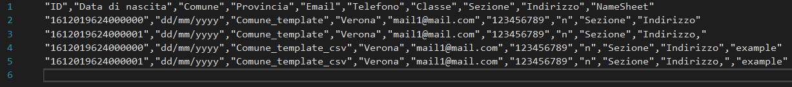
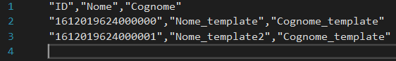

# :lock: pseudo :lock:
     

## Description
Pseudo is a program that, from files csv or xml in input, split the informations to sensible and not sensible. 
We have the file pseudo.conf that contains all the informations for the configuration. 
In there we find the fields that we want to "delete" (make pseudo-anonymous) and put these informations into the "secret.csv" file and all the rest that don't need to be hide go in the file "public.csv". If you run the program from the cmd or a shell you will see the progress bar of the different part of the program. :smile: 

## Required
 - python3

## Configuration

### Setup input(s) file

  - Move your .csv file into "flussi" folder

### Setup configuration file

  - Enter to pseudo.conf file into conf folder and change all underlined parameters
    - change the name of our files of output, input
    - set true only if you have an header in the input file, false anyways
    - set the fields to "hide" from the public file
    - change the divisor depending on which we have in the input file
    - if you want you can add the last secret file to use the same ID for the same values (eg. Name, Surname)
  - If you want you can insert how many paramers you want
    - Attention 
      - if you have an header unsert write the strings of the parameters
      - if not insert the indexes of the values

### Manage output file(s)
 - This are an example of the two output file
   - Public
     - 
   - Secret/ Private
     - 

## Directories structure
 - .github
   - ISSUE_TEMPLATE
     - bug_report.md
     - feature-request.md
   - workflows
     - python-test.yml
 - bin
   - pseudo.py <- main file  
   - test_pseudo.py
 - conf
   - pseudo.conf <- configuration file
 - docs
   - LICENSE
   - README.md
 - flussi
   - example.csv
   - *.xml/ *.csv <- input file(s)
   - *.csv <- output file(s)
 - log
   - trace.log
 - requirements
   - requirements.txt
 - .gitignore
   
### Execution examples
 - python3 pseudo.py
 - python3 test_pseudo.py

# Changelog
 - [Version_02.01_2021-1-30](#Version_0201_2021-1-30)
 - [Version_01.01_2021-1-23](#Version_0101_2021-1-23)

## Version_02.01_2021-1-30
 - Managed xml files
 - Managed multi files (.csv, .xml)
 - Managed different headers
 - Added progress bar

## Version_01.01_2021-1-23
 - Initial version
 - Added configuration file
 - anonymus => pseudo
 - Added log and file trace.log
 - Added parameter in the file pseudo.conf

---
Made by Castellani Davide & Bellamoli Riccardo
If you have any problem please contact me:
- [help@castellanidavide.it](mailto:help@castellanidavide.it)
- [riccardobellamoli2003@gmail.com](mailto:riccardobellamoli2003@gmail.com)
- [Issue](https://github.com/CastellaniDavide/pseudo/issues)
